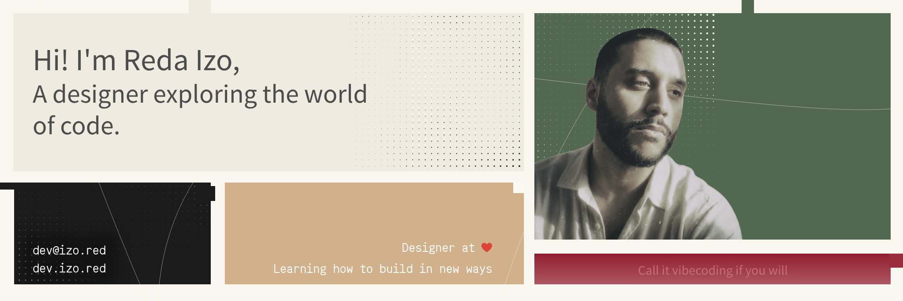

### Hey, I'm Reda Izo

<a href="https://dev.izo.red/?utm_source=github&utm_medium=profile&utm_campaign=readme_banner">
<picture>
    <source srcset="./header-light.png" media="(prefers-color-scheme: light)">
    <source srcset="./header-dark.png" media="(prefers-color-scheme: dark)">
    
</picture>
</a>

Creative Director from Brussels. Recently started building tools and can't seem to stop. Sharing them in case they help someone else too. Dual RTX 4090s, a fleet of containers, and a deep obsession with making LLMs actually useful. 10+ years in Cinema 4D CGI and photography, now aiming to build systems that power the next wave of creative tooling.

---

#### 🛠️ Building

- **[OpenMemo](https://github.com/izored/OpenMemo)**   — A local-first, open-source toolkit to structure scattered resources. Built for brains that collect too much and organise too little.
- **[openTimeline](https://github.com/izored/openTimeline)**   — A local-first, open-source personal timeline for documenting life events — legal, career, anything worth tracking. Your data, your schema, your code.
- **[rightclick-optimise-png](https://github.com/izored/rightclick-optimise-png)**  — Lossless PNG compression straight from your right-click menu. Because the extra steps were annoying me.
- **[rightclick-copyright](https://github.com/izored/rightclick-copyright)**   — Tag your images with EXIF/IPTC/XMP copyright metadata via right-click. A photographer's small act of self-defense.
- **[AnimIconSVG](https://github.com/izored/animiconsvg)**   — A Framer sidebar plugin that brings ItsHover animated icons directly to your canvas. Search 263+ icons, preview stroke-draw hover animations, and insert in three modes.
---

#### 🧰 Tools I actually use

**Creative**
Cinema 4D · Octane Render · After Effects · Photoshop · Affinity Suite

**Building & exploring**
VS Code · Claude Code · Cowork · OpenMemo
Ollama · OpenWebUI · ComfyUI · n8n · Docker · Cloudflare · PowerShell

---

#### 🧠 Models

**Local, on the two 4090s (Ollama)**

- `Qwen3.8` · `Qwen3-Coder-Next 80B` · `Qwen3.6 35B` · `Qwen3.5 27B / 9B` : daily drivers for code and reasoning
- `Gemma 4 31B` · `Gemma 4 26B-A4B` · `Gemma 4 E4B` : fast creative and everyday tasks
- `DeepSeek R1 32B` : long reasoning chains
- `gpt-oss 20B` · `Nemotron 3 Nano 4B` · `Phi-4-mini` : small, quick, always resident
- `nomic-embed-text v2 MoE` : the embeddings behind OpenMemo's semantic search

**Hosted**

- `Claude Opus 5` · `Claude Sonnet 5` · `Claude Fable 5.1` : through Claude Code and Cowork
- `Kimi 2.6 Pro`
- `Google Gemini`
- `Perplexity`

---

#### 🎨 Background

Creative Director with a decade of visual production experience. Fluent in French & English. When I'm not tuning inference servers, I'm in Cinema 4D, behind a camera, or cooking something that takes way too long.

